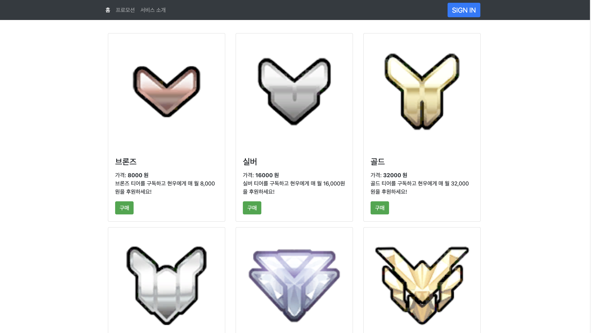

# polaris-store

polaris-store는 Go 언어로 풀스택 웹 개발을 빠르게 연습하기 위해 만들어진 프로젝트입니다.  
Go는 정말 멋진 언어입니다!  

## 기술 스택

- JavaScript 런타임 : Node.js (v16.13.1)
- 프론트엔드 개발 언어 : JavaScript
- 프론트엔드 UI 라이브러리 : React (v17)
- 프론트엔드 UI 프레임워크 : Bootstrap (v4)
- 백엔드 개발 언어 : Go (v1.17.6)
- 백엔드 프레임워크 : Gin
- DBMS : MySQL
- ORM : GORM
- 클라우드 컴퓨팅 플랫폼 : Google Cloud Platform - App Engine

## 프론트엔드 구현 사항

- 상품 목록(Product List) 뷰
- 주문 목록(Order List) 뷰
- 서비스 소개(Service Intro) 뷰
- 회원 프로필(Member Profile) 뷰
- 인증(Auth) 모달
- 주문 결제 프로세스

## 백엔드 구현 사항

- ID로 특정 회원 조회
- 이름으로 특정 회원 조회
- 회원 생성
- 회원 접속
- 회원 접속 해제
- 상품 목록 조회
- 프로모션 상품 목록 조회
- ID로 특정 상품 조회
- 회원 ID로 주문 목록 조회

## DB 구조

- 데이터베이스 이름 : polaris_store
- 테이블
  - members
  - orders
  - products
- 인덱스
  - orders 테이블은 members 및 products 테이블을 참조하기 때문에 각 테이블의 id 컬럼에 대한 인덱스가 필요하다.
